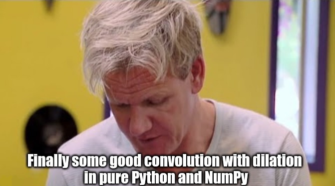
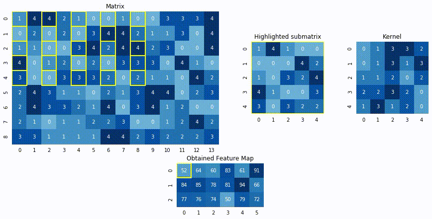

# Convolution from scratch  
  

### Motivation on repository
I tried to find the algorithm of convolution with dilation, implemented from scratch on a pure python, but could not find anything. There are a lot of self-written CNNs on the Internet and on the GitHub and so on, a lot of tutorials and explanations on convolutions, but there is a lack of a very important thing: proper implementation of a generalized 2D convolution for a kernel of any form with adjustable on both axes parameters, such as stride, padding, and most importantly, dilation. The last one cannot be found literally anywhere! This is why this repository and this picture above appeared.

### Who needs this?
If you've ever wanted to understand how this seemingly simple algorithm can be really implemented in code, this repository is for you. As it turns out, it's not so easy to tie all the parameters together in code to make it general, clear and obvious (and optimal in terms of computations).  
Feel free to use it as you wish.

# Contents
* [Explanation](#explanation)
    * [Idea in the nutshell](#idea-in-the-nutshell)
    * Details on implementation (soon)
* [Usage](#usage)
    * [Example with your matrix and kernel](#example-with-your-matrix-and-kernel)
    * [Example with your picture and filter](#example-with-your-image-and-filter)
* [Running tests](#running-tests)
* [Citation](#citation)

## Explanation
### Idea in the nutshell
In 2D convolution we move some small matrix called <i>Kernel</i> over 2D <i>Image</i> (some matrix) and multiply it element-wise over each sub-matrix, then sum elements of the obtained sub-matrix into a single pixel of so-called <i>Feature map</i>. We move it from the left to the right and from the top to the bottom. At the end of convolution we usually cover the whole <i>Image</i> surface, but that is not guaranteed with more complex parameters.  
This GIF [(source)](https://stackoverflow.com/questions/42450389/how-a-filter-in-convolutional-neural-network-can-generate-multiple-channels) below perfectly presents the essence of the 2D convolution: green matrix is the <i>Image</i>, yellow is the <i>Kernel</i> and <s>red</s> coral is the <i>Feature map</i>:
 


Let's clarify it and give a definition to every term used:
- <b>Image</b> or input data is some matrix;
- <b>Kernel</b> is a small matrix that we multiply with sub-matrices of an Image;
    - <b>Stride</b> is the size of the step of the slide. For example, when the stride equals 1, we move on 1 pixel on every step, when 2, then we move on 2 pixels and so on. [This picture](files/expl_stride.png) can help you figure it out;
    - <b>Padding</b> is just the border of the <i>Image</i> that allows us to keep the size of initial <i>Image</i> and <i>Feature map</i> the same. In the GIF above we see that the shape of <i>Image</i> is 5x5 but the <i>Feature map</i> is 3x3. The reason is that when we use <i>Kernel</i>, we can't put its center in the corner, because if we do, there is a lack of pixels to multiply on. So if we want to keep shape, we use padding and add some zero border of the image. [This GIF](files/expl_padding.gif) can help you figure it out;
    - <b>Dilation</b> is just the gap between kernel cells. So, the regular dilation is 1 and each cell is not distanced from its neighbor, but when we set the value as 2, there are no cells in the 1-cell neighborhood — now they are distanced from each other. [This picture](files/expl_dilation.png) can help you figure it out.   
- <b>Feature map</b> or output data is the matrix obtained by all the calculations discussed earlier.

This is it — that easy.
<!-- ### Details on implementation -->

## Usage 
### Example with your matrix and kernel
Say, you have a matrix like this one:
```python
matrix = np.array([[1, 4, 4, 2, 1, 0, 0, 1, 0, 0, 3, 3, 3, 4], 
                   [0, 2, 0, 2, 0, 3, 4, 4, 2, 1, 1, 3, 0, 4],
                   [1, 1, 0, 0, 3, 4, 2, 4, 4, 2, 3, 0, 0, 4],
                   [4, 0, 1, 2, 0, 2, 0, 3, 3, 3, 0, 4, 1, 0],
                   [3, 0, 0, 3, 3, 3, 2, 0, 2, 1, 1, 0, 4, 2],
                   [2, 4, 3, 1, 1, 0, 2, 1, 3, 4, 4, 0, 2, 3],
                   [2, 4, 3, 3, 2, 1, 4, 0, 3, 4, 1, 2, 0, 0],
                   [2, 1, 0, 1, 1, 2, 2, 3, 0, 0, 1, 2, 4, 2],
                   [3, 3, 1, 1, 1, 1, 4, 4, 2, 3, 2, 2, 2, 3]])
```
<!--    -->

And a kernel like this one:
```python
kernel = np.array([[0, 1, 3, 3, 2], 
                   [0, 1, 3, 1, 3],
                   [1, 1, 2, 0, 2],
                   [2, 2, 3, 2, 0],
                   [1, 3, 1, 2, 0]])
```
<!--    -->


Then, say, you want to apply convolution with `stride = (2, 1)` and `dilation = (1, 2)`. All you need to do is just simply pass it as parameters in `conv2d` function:
```python
from convolution import conv2d

feature_map = conv2d(matrix, kernel, stride=(2, 1), dilation=(1, 2), padding=(0, 0))
```
And get the following result:


### Example with your image and filter
For example, if you want to blur your image, you can use "[Gaussian blur](https://en.wikipedia.org/wiki/Gaussian_blur)" and take the corresponding kernel, while some others can be found [here](https://en.wikipedia.org/wiki/Kernel_(image_processing)).
```python
import imageio
import matplotlib.pyplot as plt
import numpy as np


gaussian_blur = np.array([
    [1, 2, 1],
    [2, 4, 2],
    [1, 2, 1]
]) / 16


image = imageio.imread('files/pic.jpg')
plt.imshow(image)
```


Then you just need to use `apply_filter_to_image` function from `convolution.py` module.  
I'm going to make this picture blurry:
```python
filtered_image = apply_filter_to_image(image, gaussian_blur)
plt.imshow(filtered_image)
```


Tadaa, it's blurred!

> P.S. This photo is taken near the alpine lake Bachalpsee in Switzerland. Photo is under free license.  

### Running tests
```bash
python -m unittest tests.py
```

#### Citation
If you used this repository in your work, consider citing:  
```
@misc{Convolution from scratch,
    author = {Detkov, Nikita},
    title = {Implementation of the generalized convolution with dilation from scratch in Python and NumPy},
    year = {2020},
    publisher = {GitHub},
    journal = {GitHub repository},
    howpublished = {\url{https://github.com/detkov/Convolution-From-Scratch}},
}
```

Thanks [Matthew Romanishin](https://github.com/matthewromanishin) for the project idea.
